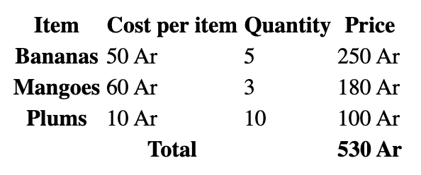

# HTML exercise 02: Tables

In the accompanying file `02-tables.html` you'll find a lone `<table> </table>` element.

Add the necessary HTML to this table, to make it look like this:

Save, add, and then `commit` your changes in your forked repo. Make sure to `push`!