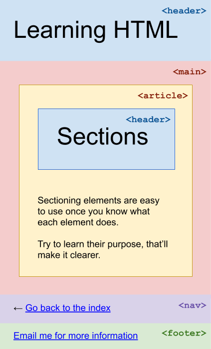

# HTML exercise 04: Sectioning elements

In the accompanying file `04-sectioning-elements.html` please divide the content up into various types of elements, as illustrated in this diagram below.

**Hint**: You shouldn't have to delete any of the existing HTML. Instead, wrap the contents of the document with the new elements, in the right way.

Save, add, and then `commit` your changes in your forked repo. Make sure to `push`!