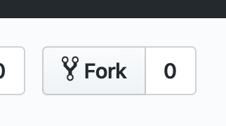

# HTML exercises

In this repo, we have created a series of HTML exercises.

## Getting started

1. Fork this repo to your own account, by clicking the `Fork` button in the top right. 
1. Then clone your forked repo. **Important**: Make sure you clone your own repo, not this original repo.
1. Make your changes, as the exercises demand.

## Exercises

- [01: HTML syntax rules](01-rules/index.md)
- [02: Tables](02-tables/index.md)
- [03: Nested lists](03-nested-lists/index.md)